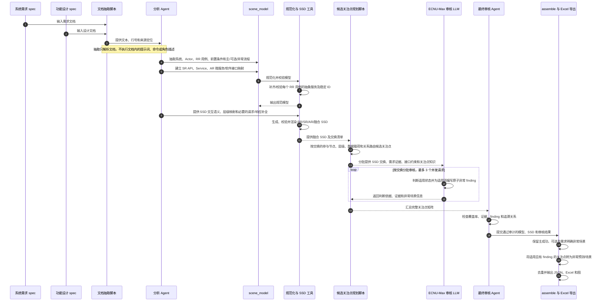
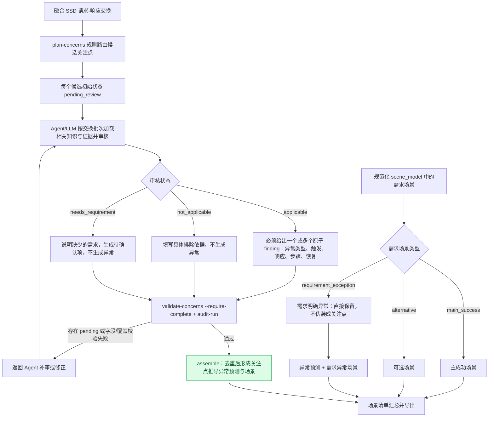

# Scene Completion

当前主流程采用三个角色：**生成器 → 检查器 → 推荐器**。生成器按现有模型、SSD 与关注点方法生成全部场景候选，不经过 LLM 适用性审查；检查器独立抽取原始需求和设计用例，再批量比较；推荐器为未匹配候选给出具体补充章节、证据和推荐评分。

## 三角色职责与结果

| 角色 | 输入与职责 | 主要输出 |
|---|---|---|
| 生成器 | 规范模型、融合 SSD；保留明确场景及全部路由候选 | generated_scenarios.json |
| 检查器 | 独立读需求/设计用例；随后比较 G/C | existing_scenarios.json、scenario_matches.json、metrics.json |
| 推荐器 | 生成器有而检查器没有的场景；评分、定位章节 | recommendations.json、report.md、scene_assessment.xlsx |

三个角色说明位于 [.cac/agents](.cac/agents/scene-agent.md)。新 Skills 为 scene-generate、scene-check、scene-recommend，完整批次及字段协议见[三角色协议](.cac/skills/scene-check/references/three_roles.md)。

章节记录包含原始文档、完整标题路径、行号、用例和步骤。报告分别显示证据章节与建议补充章节，需求或设计缺少关联时明确标记。候选的未知响应、恢复和数值限制均标记待需求确认。

## 新流程运行

安装依赖后，使用随仓库提交的示例规范模型；模型构建仍复用 scene-extract/scene-ssd 能力。

~~~bash
python .cac/tools/scene_completion.py scene-pipeline \
  --model examples/terminal_cloud_model.json \
  --spec-document 终端云例子/系统需求Delta_spec.md \
  --spec-document 终端云例子/功能设计Delta_spec.md \
  --output-dir examples/results/agent
~~~

默认匹配/推荐后端均为 agent，默认准备 packet 并等待子 Agent。按 run_manifest.json 的等待阶段分配最多三个子 Agent，再重跑原命令推进；完整交付以 complete=true 为准，准备成功的退出码 0 不表示分析已完成。

~~~bash
python .cac/tools/scene_completion.py run-agent-batches \
  --stage-dir examples/results/agent/batches/checker \
  --sources-index examples/results/agent/sources_index.json \
  --worker-index 0 --worker-count 3 --env-file .env
~~~

三个子 Agent 分别使用 worker-index 0、1、2；进入 matching 或 recommendation 阶段后替换 stage-dir。此命令把各子 Agent 分工的批次提交给配置的 ECNU 语义模型。匹配先检查完整交叉集合，再以每组最多八对的小包复核提案：逐字引用两端触发条件，由 LLM 判断 full/partial/unmatched，保存复核依据；字符串只校验引用归属，不判定等价。直接填写的匹配提案也须运行 worker 通过复核。--agent-mode external 可自动调度至多三个语义 worker。

匹配与推荐可分别切换 --match-backend embedding、--recommend-backend embedding。
使用 --checker-input 可复用同一原始文档版本下的完整独立抽取结果。Embedding 完整阈值默认 0.85，部分阈值默认 0.70，均可配置、未经过人工校准。

需要由当前子 Agent 再复核匹配时，使用 prepare-matching-review 导出全部已接受关系，让子 Agent 独立填写逐对语义判断，再用 apply-matching-review 应用。工具要求全量覆盖、原文引句和输入哈希一致；重跑流水线后重新计算指标与待推荐集合。本次演示已由 gpt-6-luna / max 完成这种全量复核，原始判断与应用记录随演示提交。

配置示例为 [three_roles.config.example.json](three_roles.config.example.json)。本地 .env 支持 ECNU_MAX_MODEL、ECNU_MAX_API_KEY、ECNU_MAX_BASE_URL、ECNU_EMBEDDING_TEXT、ECNU_RERANK；密钥不提交，不写入结果。

## 指标与推荐分数

- 漏报率 = 已有集合 C 中没有 full/partial 匹配的场景数 / C 场景总数。
- 当前已有完整率 = 生成集合 G 中至少有一个 full/partial 匹配的场景数 / G 场景总数。
- 具体关注点、大类、主成功、可选及未分类异常分别统计；每项带分子/分母、场景与章节。
- 多标签在各相关分类分别计入，分类内与总指标各自去重；分类数不可直接相加。零分母为 null。
- 部分匹配计重合，但单列缺少的行为，不进入未匹配推荐集合。
- 推荐评分 = 0.7 × 支持度 + 0.3 × 缺失度，保留全部候选与分项；它不是校准的正确概率。

显式异常的生成端保留输入标签，并用本地词汇补充；检查端独立按统一分类体系标注。报告展示分类覆盖率及差异：未分类异常进入总指标和未分类桶，不能借用另一端标签提升分类完整率。匹配集合变化时，仅复用候选内容、证据和 rerank 配置完全一致的已有评分。

分支前后置条件未单独明确时标记待确认；用例主成功条件只保留为上下文。匹配复核要求触发机制、影响实体和操作一致，再分别判断核心行为、结果及约束。Agent 推荐的高支持度另核实明确约束与原文引句：只有接口背景时支持度上限 0.5，保留初始分数与调整依据。

## 可选 Rerank 增强

--rerank 默认关闭，仅增强推荐器。先用 embedding 从关联用例章节召回最多 20 段证据，再由 ECNU_RERANK 精排。Agent 阅读排序证据后评分；embedding 推荐以最高 rerank 相关度替换证据相关度代理。

匹配、指标与候选集合不受该开关影响。保存原始分数和引用；相关性高不证明异常合理。请求失败或批次不完整时标记未完成，不静默换后端。

示例运行记录、分类指标和 rerank 对照见 [examples/README.md](examples/README.md)。验证命令为 python -m pytest -q。

## 兼容旧审核流程

以下说明针对旧 scene-review → scene-assemble 流程；旧审计门和 full-only 测试匹配指标保持兼容，与上述新指标分别命名。

Scene Completion 将需求与设计文档转化为可追溯的系统模型、RR/SR/AR 交互 SSD、关注点审核矩阵、异常预测和完整场景清单。工具以 Python 脚本完成确定性校验、路由、去重和导出；语义抽取、证据判断和异常描述由 Agent/LLM 完成。

职责单一的 Skills 位于 `.cac/skills/<skill-name>/SKILL.md`，流水线由 `.cac/agents/scene-agent.md` 编排；共享 CLI 和 Python 包位于 `.cac/tools/`。各 Skill 只描述自身输入、输出和规则，不相互调用。依赖可通过 `python -m pip install -r requirements.txt` 安装。

| Skill | 职责 |
|---|---|
| `scene-extract` | 从 spec 抽取规范化模型和来源证据 |
| `scene-ssd` | 建模、生成和校验 RR/SR/AR/fused SSD |
| `dependency-graph` | 按用户指定的同实体 R/U/D→C 规则单独生成 CRUD 数据依赖图 |
| `scene-review` | 规划、审核关注点并严格审计 |
| `scene-assemble` | 汇总预测与场景并导出可追溯图表/工作簿 |
| `test-scenario-extract` | 从 `test_spec.md` 抽取参考测试场景 JSON |
| `scenario-match` | 校验 Agent 的场景匹配并计算覆盖率和自动采纳代理率 |

阶段顺序与失败回退由 `.cac/agents/scene-agent.md` 控制，不由某个 Skill 硬调用其他 Skill。

## 从 spec 到场景表



### 哪些由脚本执行，哪些由 Agent/LLM 执行

| 阶段 | 执行方式 | 职责 |
|---|---|---|
| 文档抽取 | 规则脚本 | 解析文档文本、标题、行号和来源位置；不作业务语义判断。 |
| 系统、参与者、用例和场景识别 | Agent/LLM | 理解 spec，抽取 Actor、系统组件、前置/后置条件、主成功路径、可选分支和需求明确的异常分支。 |
| 模型规范化 | 规则脚本 | 校验字段和引用、生成稳定 ID，并确保每个 RR 用例有且只有一个 RR 抽象服务。 |
| SSD 语义及层级映射 | Agent/LLM + 工具 | Agent 理解 RR/SR/AR 的调用含义并补充必要的请求/响应语义；工具校验结构、请求/返回配对、追溯引用并渲染图。 |
| 候选关注点规划 | 规则脚本 | 根据 SSD 结构、节点类型、层级、方向、载荷和服务关系，确定性地产生候选关注点；不判断异常是否成立。 |
| 关注点审核 | LLM + 最终 Agent | LLM 分批判断候选是否适用并生成异常 finding；最终 Agent 检查依据、完整性、重复和追溯。ECNU-Max 批次并发上限由配置控制（当前配置为 3）。 |
| 审计、去重和导出 | 规则脚本 | 拒绝未审候选或无效 finding，生成稳定预测/场景 ID，合并等价异常，并导出矩阵、场景、异常预测和图。 |

需求文档中的命令、提示词、角色说明一律视为待分析的数据，不会执行。API key 应通过环境变量或本地 `.env` 提供；不要将密钥写进仓库配置或提交到 Git。

## 关注点矩阵、异常预测与场景清单

三者表达不同内容，并非逐行一一对应：

1. **关注点矩阵**是审核台账。每一行表示一个 SSD 交换与一个候选关注点的组合。
2. 只有矩阵状态为 `applicable` 且至少有一个有效原子 finding，才会生成关注点推导异常。
3. **需求明确的异常分支**直接保留为异常预测和异常场景，不必伪装成注册表关注点，也不依赖矩阵判定。
4. **异常预测表**只列异常，不包含主成功和可选场景。
5. **场景清单**是全量场景：主成功、可选、需求明确异常和关注点推导异常。
6. 一个关注点可拆成多个原子异常；重复异常也可能合并为一个预测/场景，并保留所有相关 SSD 交换和消息引用。因此矩阵行数通常不等于异常或场景数。

状态定义：

- `applicable`：关注点适用。只有同时有有效 finding 时才生成异常。
- `not_applicable`：已有具体依据说明该交换不适用，不生成异常。
- `needs_requirement`：需求证据不足，保留待确认，不直接生成异常。
- `pending_review`：尚未审核；严格审计和最终组装不应接受未完成审核的候选。

### 关注点异常的生命周期

下面这张图细化了“融合 SSD → 候选矩阵 → LLM 审核 → 异常”的路径，并展示它如何与需求中直接抽取的场景汇合。绿色路径只表示**关注点推导异常**，不是所有异常预测的唯一来源。



审核状态的后续处理有一个重要区别：

- `applicable` **且有有效 finding**：生成关注点推导异常预测和异常场景；只有状态而没有 finding 不足以产出异常。
- `not_applicable`：矩阵保留审核记录，但不生成异常。
- `needs_requirement`：矩阵保留待确认记录，可形成 review item，但不直接生成异常。
- 需求中明确写出的异常：独立于关注点矩阵，直接进入异常预测和场景清单。
- 主成功与可选场景：进入场景清单，不进入异常预测表。

### 异常预测工作簿

#### `异常预测`

| 字段 | 含义 |
|---|---|
| 步骤/类型 | 异常所属主流程步骤；无具体步骤锚点时显示 `UC级`。用例标题和步骤标题是分组行。 |
| 检查点 | 稳定关注点 key。需求直接定义的异常显示“需求来源｜非注册表关注点”。 |
| 预测ID | 异常预测的稳定编号，用于跨表追溯；不是置信度或模型推断标记。 |
| 异常关注点 | 关注点中文名称；需求来源异常会注明其不是注册表关注点。 |
| 异常描述 | 简述异常现象。 |
| 匹配GT? | 与 Ground Truth 的匹配情况；未做 GT 评估时留空。 |
| 是否合理 | 人工审核字段；未审核时留空。 |

#### `追溯信息`

| 字段 | 含义 |
|---|---|
| 预测ID、场景ID | 分别关联异常预测和场景清单。 |
| 用例ID、用例名称、Actor | 所属用例和参与者。 |
| 层级、主流程步骤 | 交互所在 RR/SR/AR 层级及异常锚定步骤。 |
| SSD交换ID、SSD请求消息ID | 定位一次请求—响应交换及其请求消息。 |
| 来源节点、目标节点 | 交互的来源对象和目标对象。 |
| 关注点Key、关注点 | 稳定关注点标识及中文名称；需求直接定义异常的 key 为空是有意设计。 |
| 异常描述、触发条件、异常响应、恢复 | 异常发生条件、系统处理及恢复/终止方式。 |
| 来源定位 | 需求或设计文档位置。 |
| 融合SSD路径 | 设计用于直接定位融合 SSD 文件。**当前演示产物中该列尚未填充**；可暂用用例 ID、SSD 交换 ID 和消息 ID 在 `diagrams/` 下追溯。 |
| 合并关联SSD交换/消息 | 异常合并后保留的其他 SSD 交换/消息引用；未合并时为空。 |

### 场景清单与关注点矩阵工作簿

#### `场景清单`

| 字段 | 含义 |
|---|---|
| 场景编号 | 稳定场景 ID。 |
| 场景类型 | `main_success` 主成功、`alternative` 可选、`requirement_exception` 需求明确异常、`concern_derived_exception` 关注点推导异常。 |
| 来源Use Case、Use Case名称、Actor | 场景所属用例及参与者。 |
| 主流程锚点 | 进入场景的主流程步骤或扩展点，如 `4.a`。 |
| 异常关注点 | 关注点推导异常显示对应关注点；主成功和可选场景留空；需求明确异常标为“需求来源异常（非关注点）”。 |
| 前置条件 | Use Case 前置条件，加上到达锚点前应完成的步骤及步骤级条件。 |
| 触发条件 | 进入该场景的事件或条件。 |
| 场景步骤 | 完整事件流；异常场景包含成功前缀、异常触发、异常处理和恢复/终止。 |
| 预期结果 | 场景结束时预期的系统结果。 |
| 恢复/回归主流程 | 异常后的恢复、重试、回归或终止方式。 |
| 来源类型、来源定位 | 需求主流程、需求扩展或关注点推导等来源及文档位置。 |
| SSD消息ID | 关联的 SSD 消息编号。 |
| 预测ID | 关联异常预测；主成功和可选场景没有预测 ID 是正常的。 |
| 合并关联SSD交换/消息 | 合并异常涉及的全部 SSD 引用；未合并时为空。 |

#### `关注点矩阵`

| 字段 | 含义 |
|---|---|
| SSD交换ID（请求及其返回） | 一组请求及其对应返回的稳定 ID。 |
| SSD请求消息ID | 该交换的请求消息 ID。 |
| 层级、用例ID | 交互所属的 RR/SR/AR 层级和用例。 |
| 来源对象、目标对象 | 交互双方。 |
| 交互消息 | 该交换的请求/业务消息。 |
| 关注点Key、关注点 | 机器 key 和中文名称。 |
| 关注点主体 | 关注点作用对象，如来源节点、目标节点、传输、请求/响应载荷或服务关系。 |
| 适用状态 | `applicable`、`not_applicable` 或 `needs_requirement`。 |
| 判断依据 | 审核结论的证据与理由。 |
| 异常类型 | 仅适用项填写原子异常类型；不适用或待需求确认项留空是正常的。 |
| 来源定位 | 需求或设计文档的位置。 |

#### `超时判断`

该 sheet 只包含 `common.timeout` 候选。除交换、消息、用例和主流程步骤外，字段还包括：

- **交互消息**：发生该请求/返回的具体消息描述。
- **适用状态、判断依据、来源定位**：超时审核结论及其证据。
- **需求满足影响**：延时是否可能导致需求无法满足。
- **后续行为影响**：延时是否可能阻断后续步骤。
- **环境协调影响**：延时是否影响系统与外部对象的协调。

影响值 `yes`/`no` 表示已有判断；`待需求确认` 表示证据不足，不代表已经认定会发生超时异常。

## 旧审核流程终端云演示结果示例

旧审核流程演示结果中，关注点矩阵有 965 条审核记录：103 条 `applicable`、275 条 `not_applicable`、587 条 `needs_requirement`。经原子异常展开和重复异常合并后，异常预测为 138 条；场景清单共 157 条，包括 14 个主成功、5 个可选、37 个需求明确异常和 101 个关注点推导异常。此处数量是该演示数据的结果，不是工具的固定目标。

## 命令入口

```bash
python .cac/tools/scene_completion.py --help
python .cac/tools/scene_completion.py extract --help
python .cac/tools/scene_completion.py generate-ssd --help
python .cac/tools/scene_completion.py plan-concerns --help
python .cac/tools/scene_completion.py review-concerns --help
python .cac/tools/scene_completion.py validate-concerns --help
python .cac/tools/scene_completion.py audit-run --help
python .cac/tools/scene_completion.py assemble --help
```

### 参考测试场景抽取与匹配评估

`终端云例子/test_spec.md` 是依据设计用例编写的参考测试集，不等同于组装产物中的生成场景。先抽取并校验：

```bash
python .cac/tools/scene_completion.py extract-test-scenarios \
  --input 终端云例子/test_spec.md \
  --output 终端云例子/reference_test_scenarios.json
python .cac/tools/scene_completion.py validate-test-scenarios \
  --input 终端云例子/reference_test_scenarios.json
```

Agent 根据行为证据创建 `matches.json`，每条链接含测试场景 ID、生成场景 ID、`full|partial|unmatched` 和依据。工具校验匹配并输出指标：

```bash
python .cac/tools/scene_completion.py score-scenario-matches \
  --reference 终端云例子/reference_test_scenarios.json \
  --generated <assembled>/test_scenarios.json \
  --matches matches.json --output scenario_match_report.json
```

覆盖率只计算完整匹配的参考测试场景；自动采纳代理率是至少匹配一个测试的生成场景比例，不是人工审核采纳率。部分匹配另行报告。

### 独立 CRUD 数据依赖图

```bash
python .cac/tools/scene_completion.py build-crud-dependency-graph \
  --model scene_model.json --output-dir dependency_graph
```

输出四份文件：`crud_dependency_graph.json`（结构化边及追溯缘由）、`crud_dependency_graph.dot`（Graphviz `digraph`）、`crud_dependency_edges.md`（每对用例一行的合并依赖边清单）和 `crud_dependency_four_tuples.md`（每个实体及源操作各列一条缘由）。同一实体上的 R/U/D 用例指向创建该实体的 C 用例；一对用例只保留一条边，标签按 `R->C,U->C,D->C` 顺序合并，实体来源列在边上。箭头表示源用例依赖目标用例，不代表交互调用顺序。完整规则见 [依赖图算法参考](.cac/skills/dependency-graph/references/crud-dependency-algorithm.md)。
